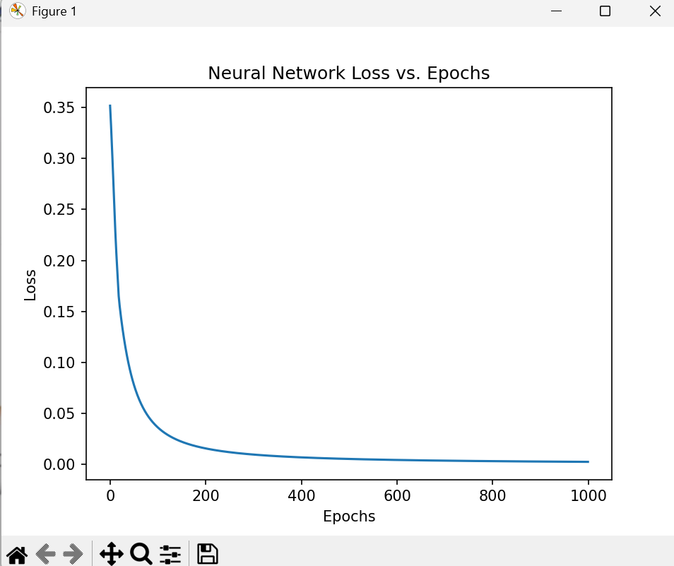

# Neural Network from scratch

This project implements a simple feedforward neural network **from scratch** in python with Numpy and Matplotlib.
It was originally inspired by [Victor Zhou’s Introduction to Neural Networks](https://victorzhou.com/blog/intro-to-neural-networks/)

## Features
- Forward propagation and backpropagation implemented manually
- Gradient descent optimization
- Visualization of the loss function over epochs
- Simple binary classification task (predicting gender from toy data)
- Extendable to multi-layer networks

## Installation
Clone the repo and install dependencies:

```bash
git clone https://github.com/your-username/neural-network-from-scratch.git
cd neural-network-from-scratch
pip install -r requirements.txt
```
## Usage

Run the training script:

```bash
python neural_network.py
```

Example output:

```yaml
Epoch 0 loss: 0.352
Epoch 10 loss: 0.239
Epoch 20 loss: 0.155
Epoch 30 loss: 0.121
Epoch 40 loss: 0.096
Epoch 50 loss: 0.078
Epoch 60 loss: 0.064
Epoch 70 loss: 0.054
Epoch 80 loss: 0.047
Epoch 90 loss: 0.041
Epoch 100 loss: 0.036
...
Epoch 960 loss: 0.001
Epoch 970 loss: 0.001
Epoch 980 loss: 0.001
Epoch 990 loss: 0.001
Emily: 0.966 # -> Female
Frank: 0.056 # -> Male
```
## Visualization
During training, the loss curve is plotted and saved to `images/loss.png`.
Example:



## Math

Assume σ(z) = 1 / (1 + e^(-z)) to be the chosen activation function.


For the output neuron:  

o1 = σ(w5 * h1 + w6 * h2 + b3)

With mean squared error (MSE) loss:  

L = (1/n) * Σ (y - ŷ)^2

The gradient of the loss with respect to `w5` is:

∂L/∂w5 = ∂L/∂ŷ ⋅ ∂ŷ/∂o1 ⋅ ∂o1/∂w5
= (-2)(y - ŷ) * σ'(sum_o1) * h1

Similar forms apply to `w6`, `b3`, and the hidden-layer parameters via the chain rule.

---

## My Contributions
- Re-implemented the network with detailed inline comments and docstrings
- Added training loss visualization (Matplotlib)
- Documented the gradient derivations (chain rule)
- Structured the repo for reproducibility and readability
- Tested on toy datasets beyond the original example

---

## Acknowledgment
This work is a learning project inspired by the excellent tutorial by Victor Zhou:  
[Introduction to Neural Networks](https://victorzhou.com/blog/intro-to-neural-networks/).

---

## Roadmap (Optional)
- [ ] Multi-layer (deep) network with configurable architecture  
- [ ] Switchable activations (ReLU/Tanh)  
- [ ] Mini-batch training & different optimizers (SGD with momentum/Adam)  
- [ ] Unit tests and CLI arguments  

```
